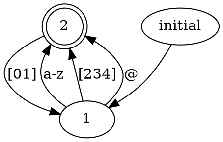

Automatizer
===========

Automatizer is an Eclipse plugin for manipulating finite-state automata and
regular expressions. It can help beginners to understand relationships between
FSA and regexps.

Installation
------------

1. Go to *Help > Install New Software...* in your Eclipse IDE
1. Add http://chaoslawful.github.io/automatizer/update/ in update sites
1. Check *Automatizer* group in available plugins list, click Next button and
   follow the installation instructions.
1. Restart Eclipse

How to Use
----------

Press **Ctrl-Alt-Z** to show automatizer view and select any text. The plugin
will then parse the selection as regular expression and show corresponding FSA
transition diagram in the view.

If the selected text is in Graphviz DOT syntax, the plugin will try to parse it
as description of a FSA and show the corresponding transition diagram. For
successfully parsing, the DOT text must comply with the following restrictions:

1. Initial state must be pointed to by a node named **initial**
1. Final states must have the attribute **shape=doublecircle**
1. The attribute **label** on the edges is the transition condition, which must
   be a single character, a character range (like *a-z*) or a character set
(like *[xyz]*)

For example:

Plugin Overview
---------------

This plugin provides the following features:

* Show ε-free NFA or minimized DFA corresponding to a regular expression
* Show streaming matching variants of the automata
* Show regular expression corresponding to current automaton using state elimination method
* Export automata transition diagram to image or Graphviz DOT file

Authors and Contributors
------------------------

* Wang, Xiaozhe (@chaoslawful)

See Also
--------

* [JFLAP - a complete tutor software for formal languages and automata](http://www.jflap.org)

